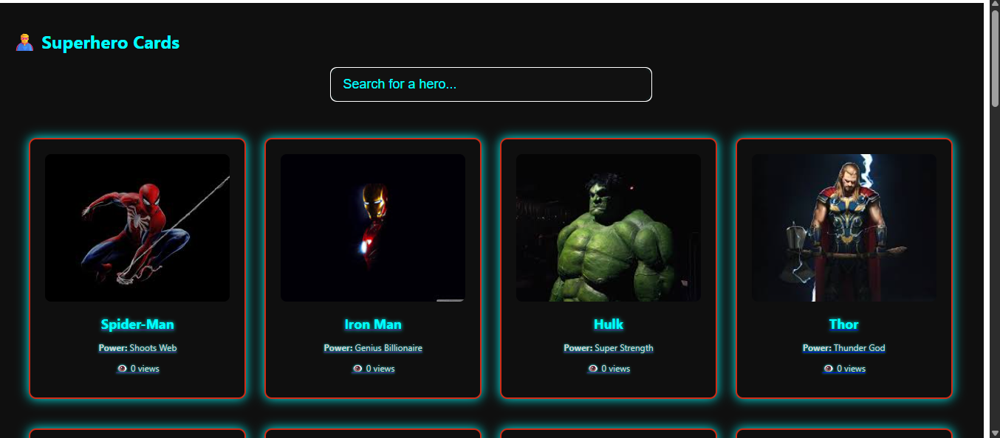
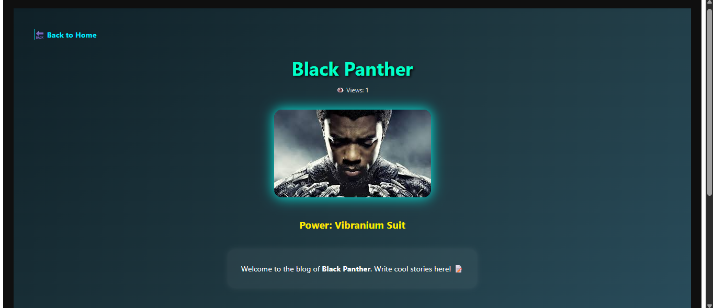
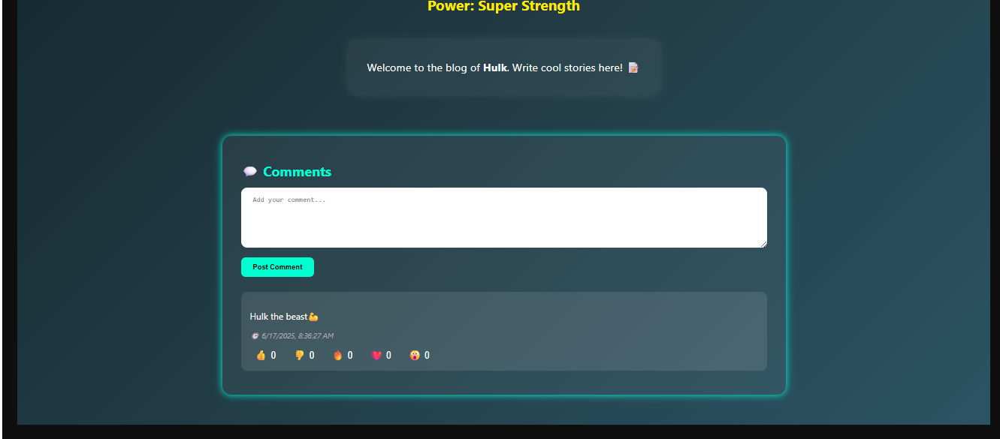
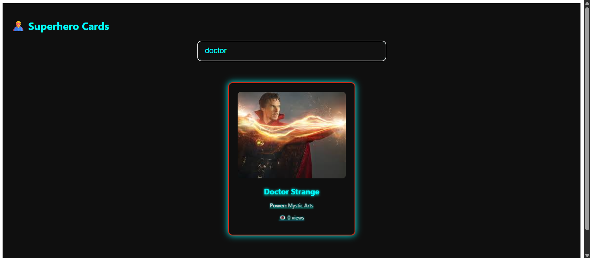

# 🦸‍♀️ Superhero Cards React App

A **React-based Single Page Application** that lets you explore superhero cards, visit detailed blog pages, and interact with comments and view counters — all stored locally using `localStorage`.

### 🌐 Live Demo

👉 [https://super-hero-cards.netlify.app](https://super-hero-cards.netlify.app)

---

## ⚙️ Features

- 🔍 Search heroes by name
- 📸 Superhero cards with name, image, and power
- 👁️ Track how many times a hero’s page was viewed
- 📝 Add comments per hero with like/dislike buttons
- 🌐 Dynamic routing using React Router
- 💾 Persistent view data using `localStorage`

---

## 🚀 Tech Stack

| Tech         | Role                      |
| ------------ | ------------------------- |
| React        | UI Framework              |
| React Router | Routing for blog pages    |
| JSX          | Templating in React       |
| CSS          | Styling UI components     |
| Netlify      | Deployment platform       |
| LocalStorage | Persisting view counters  |

---

## 📁 Project Structure

<pre>
superhero-cards-app/
│
├── node_modules/
├── public/
│   └── ...
├── src/
│   ├── components/
│   │   ├── SuperHeroCard.js
│   │   └── SuperHeroCard.css
│   │
│   ├── pages/
│   │   ├── HeroBlogPage.js
│   │   └── HeroBlogPage.css
│   │
│   ├── heroImage/
│   │   └── Black Panther.jpg
│   │   └── ... other hero images ...
│   │
│   ├── heroes.js
│   ├── App.js
│   ├── App.css
│   └── index.js
│
├── package.json
├── package-lock.json
└── README.md
</pre>

---

## 📦 How to Run Locally

1. **Clone the repository**:

```bash
git clone https://github.com/your-username/superhero-cards-app.git
cd superhero-cards-app

```
2. **Install dependencies:**

```
npm install
```
3. **Run the development server:**
```
npm start

```

## 📸 Screenshots
---
### 🏠 Home Page with Card Grid


---
### 📝 Hero Blog Page with Views 


---
### 💬 Comment option


---
### 🔍 Search box


---

## 👤 Author
**Snehlata Prajapati**

* 💼 [LinkedIn](https://www.linkedin.com/in/snehlata-prajapati/)

* 🐱 [GitHub](https://github.com/Snehlatacs)

* 🌐 [Live Site](https://super-hero-cards.netlify.app)

## 🏁 License

This project is licensed under the MIT License.
Feel free to use, fork, or enhance it for learning or personal projects!
